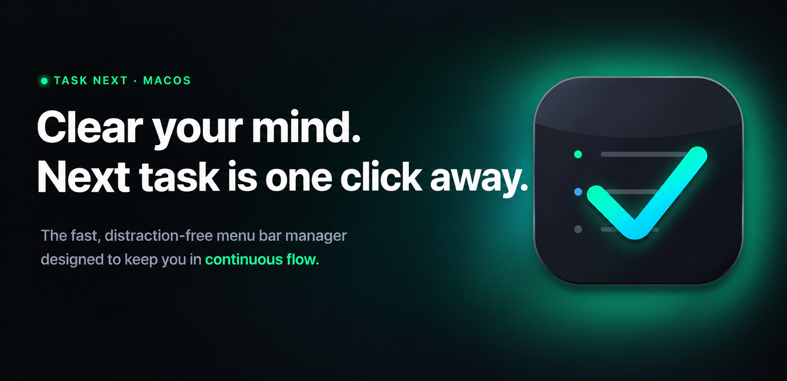
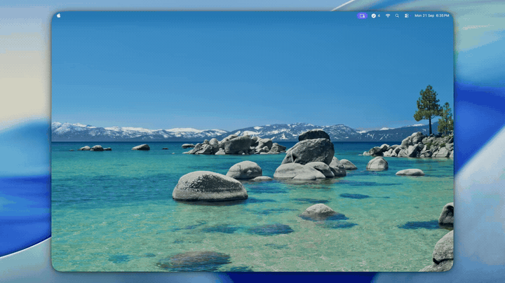

<p align="center">
  
</p>

<h1 align="center">TaskNxt</h1>

<p align="center">
  <strong>Three lanes. One popover. Zero accounts.</strong><br>
  <em>Now, Nxt, and Ltr — organize what matters today, what's coming next, and what can wait.</em>
</p>

<p align="center">
  <a href="https://github.com/thamaraiselvam/tasknxt/actions/workflows/build-and-release.yml"></a>
  <a href="https://github.com/thamaraiselvam/tasknxt/releases/latest"></a>
  <a href="LICENSE"></a>
  
  
  
  
</p>

<p align="center">
  <a href="#install"></a>
</p>

---

> You could juggle a dozen browser tabs, a sticky note app, and a reminders list. Or you could press one hotkey and see Now, Nxt, and Ltr.

## Install

### 🍺 Homebrew (recommended)

```bash
brew install thamaraiselvam/tasknxt/tasknxt
open /Applications/TaskNxt.app
```

`brew upgrade` picks up new releases automatically — the tap is updated by CI
as soon as a new version is published, so there's never a manual re-download.

> [!NOTE]
> TaskNxt is ad-hoc signed, not notarized, so on first launch Gatekeeper will
> block it as from an "unidentified developer." Right-click `TaskNxt.app` in
> Finder → **Open** → **Open** (or run
> `xattr -d com.apple.quarantine /Applications/TaskNxt.app`) once to allow it —
> the same one-time step needed for a manual `.dmg` download.

### Manual download

Grab the latest `.dmg` from [GitHub Releases](https://github.com/thamaraiselvam/tasknxt/releases/latest), open it, and drag `TaskNxt.app` to `Applications`.

Prefer to build it yourself? See [Build from source](#build-from-source) below.

<br>

## Features

- 🗂️ **Three fixed lanes per tab** — Now / Nxt / Ltr — for quick priority triage
- 🪟 **Menu bar only** — no Dock icon, no app window, just a popover
- ⌨️ **Global hotkey** — summon TaskNxt from any app with a configurable shortcut
- 🔢 **Pending-count badge** — the menu bar icon shows the active tab's incomplete task count
- 📑 **Up to 4 tabs** — separate Work, Personal, or any workspaces you like
- ✅ **Drag-and-drop** reordering, within and across lanes
- ✏️ **Inline editing** — double-click a task's text to rename it in place
- ⏳ **Auto-cleanup** — completed tasks show a countdown and purge automatically (configurable retention)
- 🗄️ **Optional archive** — keep a browsable, restorable history of completed tasks instead of deleting them
- ⚙️ **Standalone Settings window** — General, Shortcuts, Tabs, and About sections
- 🌗 **Light & dark mode** — follows your system appearance live
- 🔒 **100% local** — all data stays on your Mac; no network calls, no sign-in, no analytics
- 🚀 **Launch at login** support

<br>

## Demo

<p align="center">
  
</p>

<br>

## Usage

| Action | How |
|--------|-----|
| Open popover | Click the checklist icon in the menu bar |
| Quick open | Global hotkey (default `⌃Q` / Control+Q) |
| Add a task | Click "+ add to now..." (or nxt / ltr) in a lane |
| Reorder / retriage | Drag a task within or across lanes |
| Rename a task | Double-click its text, edit, press Enter (Esc cancels) |
| Archive or delete a task | Right-click a task for "Archive Now" / "Delete", or use the hover "x" |
| View archived tasks | Click the archive icon (📦) in the popover header |
| Change hotkey, tabs, retention, archive | Click the gear icon → opens the Settings window (General / Shortcuts / Tabs / About) |
| Quit TaskNxt | Settings → General → Quit |

<br>

## Build from source

```bash
git clone git@github.com:thamaraiselvam/tasknxt.git
cd tasknxt/app
./Scripts/build_app.sh
open .build/TaskNxt.app
```

This packages a real `TaskNxt.app` bundle (with the app icon, Dock behavior,
etc. all working correctly) rather than running the bare executable. Running
`.build/release/TaskNxt` directly (or `swift build` alone) works for quick
iteration, but macOS has no bundle to read a custom icon from in that case,
so the app shows a generic icon.

Alternatively, open `app/Package.swift` in Xcode and run the `TaskNxt` scheme
directly for the fastest edit/debug loop (same generic-icon caveat applies).

### Requirements

- macOS 13 (Ventura) or later
- Xcode 15+ (or the Swift 5.9+ toolchain) to build from source

### Run tests

```bash
cd app
swift test
```

<br>

## Architecture

```
app/
├─ Sources/
│  ├─ TaskNxt/                        SwiftUI views, menu bar shell, settings window
│  │  ├─ App/                         AppDelegate (NSStatusItem/NSPopover/badge), SettingsWindowController
│  │  └─ Features/
│  │     ├─ MenuBar/                  Popover root (tabs, lanes, archive/settings entry points)
│  │     ├─ Tasks/                    Lane and task-row views (inline edit, drag-and-drop)
│  │     ├─ Tabs/                     Tab bar and tab management
│  │     └─ Settings/                 General, Shortcuts, Tabs, About, and Archive views
│  └─ TaskNxtCore/                    Models, persistence, and app state (no SwiftUI dependency)
├─ Tests/TaskNxtTests/                Unit tests for TaskNxtCore
└─ Package.swift

openspec/                             Spec-driven change proposals and capability specs
├─ specs/                             Current behavioral specs per capability
└─ changes/                           In-flight and archived change proposals
```

`TaskNxtCore` has no SwiftUI dependency, so it builds and tests cleanly with any
Swift toolchain — useful in CI or sandboxes without a full, license-accepted Xcode
install.

<br>

## How it works

- **Lanes** — Every tab has exactly three lanes — Now, Nxt, Ltr — in that fixed order.
  Add a task inline with "+ add to now...", toggle it done, double-click its text to
  rename it in place, or drag it between lanes.
- **Tabs** — Organize lanes into up to 4 named tabs (e.g. "Work", "Personal"). Add,
  rename, reorder, or delete tabs from the Settings window's Tabs section. The menu
  bar icon shows a live badge with the active tab's incomplete-task count.
- **Retention & archive** — Completed tasks show a countdown badge and are purged
  after the configured retention period (default 2 days). If "Archive Completed
  Tasks" is enabled in Settings, purged tasks move to a browsable archive (grouped
  by completion date, with restore/delete) instead of being deleted outright; a
  task can also be archived immediately via its right-click menu.
- **Settings** — A standalone window (opened via the gear icon) with General
  (launch at login, retention, archive toggle, quit), Shortcuts (global hotkey
  recorder), Tabs (tab management), and About (version, links, bug report).
- **Privacy** — All tabs, tasks, settings, and the archive are stored only in local
  on-device storage — there's no account, no cloud sync, and no telemetry.

See `openspec/specs/` for the full behavioral specification of each capability
(`task-management`, `tab-management`, `menu-bar-shell`, `settings`, `local-persistence`).
Additional capabilities (task archive, active-tab badge, inline editing, redesigned
settings) are tracked as change proposals under `openspec/changes/`.

<br>

## Releasing

Releases are fully automated with [release-please](https://github.com/googleapis/release-please) — no manual tagging required:

1. Commit to `main` using [Conventional Commits](https://www.conventionalcommits.org/) (`feat:`, `fix:`, `docs:`, `ci:`, etc. — already the convention used in this repo).
2. On every push to `main`, the `release-please` workflow inspects new commits and keeps an up-to-date **release PR** open with the next version bump and a generated `CHANGELOG.md` entry (`feat:` → minor, `fix:` → patch, `!`/`BREAKING CHANGE:` → major).
3. Merging that release PR makes release-please push a `vX.Y.Z` tag.
4. The tag push triggers `build-and-release.yml`, which builds the universal `.dmg`, runs tests, and publishes the GitHub Release with the installer attached.

So shipping a release is just: merge normal PRs with conventional commit titles, then merge the auto-generated release PR when you're ready to cut a version.

<br>

## License

MIT — see [LICENSE](LICENSE).

<br>

---

<p align="center">
  <sub>No accounts. No cloud. No tracking. Just a fast local task list, one keystroke away.</sub>
</p>
