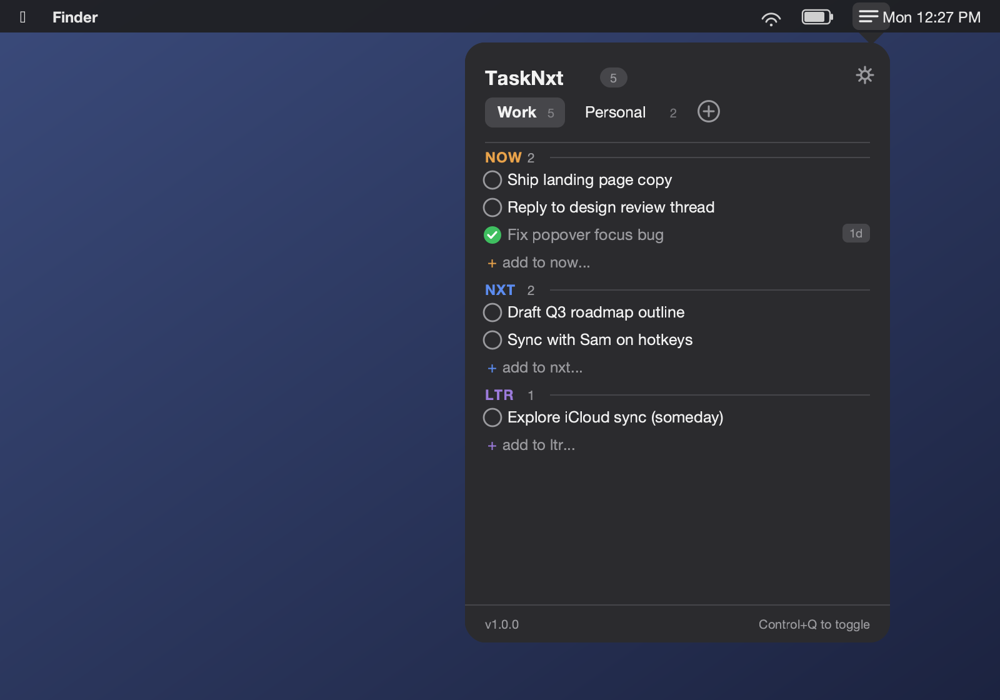
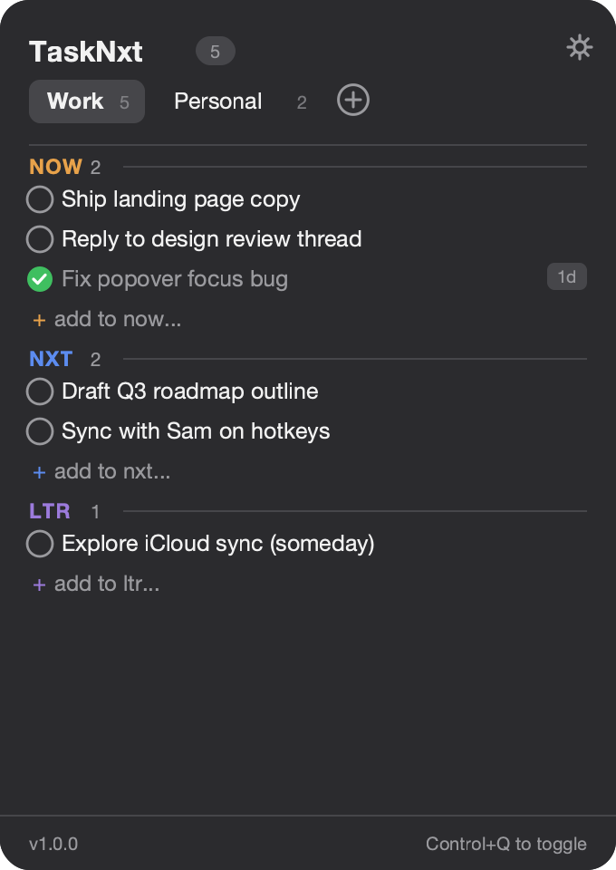
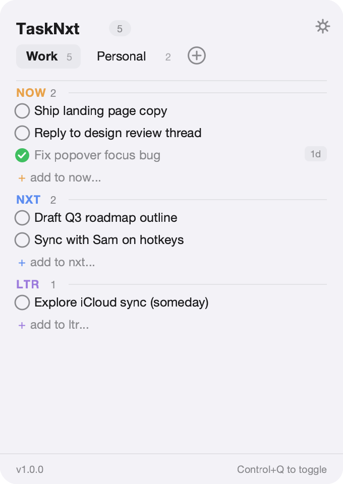
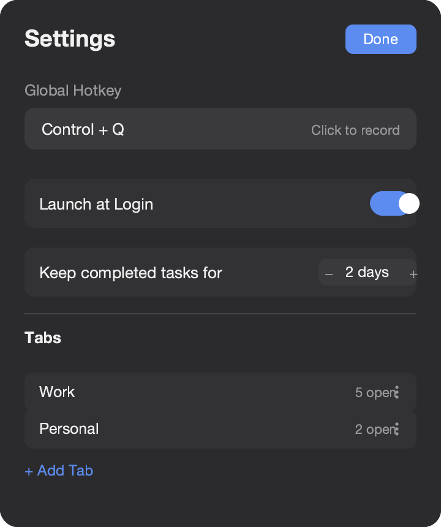

# TaskNxt

**TaskNxt** is a free, native, menu-bar-only to-do app for macOS. It lives quietly
in your menu bar and gives you three simple lanes — **Now**, **Nxt**, and **Ltr** —
to organize what matters today, what's coming next, and what can wait.

No accounts. No cloud. No tracking. Just a fast local task list, one keystroke away.

<p align="center">
  
</p>

## Features

- 🗂️ **Three fixed lanes per tab** — Now / Nxt / Ltr — for quick priority triage
- 🪟 **Menu bar only** — no Dock icon, no app window, just a popover
- ⌨️ **Global hotkey** — summon TaskNxt from any app with a configurable shortcut
- 📑 **Up to 4 tabs** — separate Work, Personal, or any workspaces you like
- ✅ **Drag-and-drop** reordering, within and across lanes
- ⏳ **Auto-cleanup** — completed tasks show a countdown and purge automatically (configurable retention)
- 🌗 **Light & dark mode** — follows your system appearance live
- 🔒 **100% local** — all data stays on your Mac; no network calls, no sign-in, no analytics
- 🚀 **Launch at login** support

## Screenshots

| Dark mode | Light mode |
| --- | --- |
|  |  |

<p align="center">
  <br>
  <sub>Settings — hotkey recorder, launch at login, retention period, and tab management</sub>
</p>

> **Note:** These screenshots are polished mockups generated to accurately reflect
> TaskNxt's current SwiftUI layout and color palette (they were not captured from a
> live screen recording session). Build and run the app locally to see the real thing!

## Getting started

### Requirements

- macOS 13 (Ventura) or later
- Xcode 15+ (or the Swift 5.9+ toolchain) to build from source

### Build & run

```bash
cd app
./Scripts/build_app.sh
open .build/TaskNxt.app
```

This packages a real `TaskNxt.app` bundle (with the app icon, Dock behavior,
etc. all working correctly) rather than running the bare executable. Running
`.build/release/TaskNxt` directly (or `swift build` alone) works for quick
iteration, but macOS has no bundle to read a custom icon from in that case,
so the app shows a generic icon.

Alternatively, open `app/Package.swift` in Xcode and run the `TaskNxt` scheme
directly for the fastest edit/debug loop (same generic-icon caveat applies).

Once running, click the checklist icon in your menu bar to open the popover, or
press the global hotkey (default: **⌃Q** / Control+Q, configurable in Settings).

### Run tests

```bash
cd app
swift test
```

## Project structure

```
app/
├── Sources/
│   ├── TaskNxt/          # SwiftUI views, menu bar shell (AppDelegate/NSStatusItem/NSPopover)
│   └── TaskNxtCore/      # Models, persistence, and app state (no SwiftUI dependency)
├── Tests/TaskNxtTests/   # Unit tests for TaskNxtCore
└── Package.swift
openspec/                 # Spec-driven change proposals and archived capability specs
```

`TaskNxtCore` has no SwiftUI dependency, so it builds and tests cleanly with any
Swift toolchain — useful in CI or sandboxes without a full, license-accepted Xcode
install.

## How it works

- **Lanes**: Every tab has exactly three lanes — Now, Nxt, Ltr — in that fixed order.
  Add a task inline with "+ add to now...", toggle it done, or drag it between lanes.
- **Tabs**: Organize lanes into up to 4 named tabs (e.g. "Work", "Personal"). Add,
  rename, reorder, or delete tabs from Settings.
- **Retention**: Completed tasks show a countdown badge and are automatically purged
  after the configured retention period (default 2 days).
- **Privacy**: All tabs, tasks, and settings are stored only in local on-device
  storage — there's no account, no cloud sync, and no telemetry.

See `openspec/specs/` for the full behavioral specification of each capability
(`task-management`, `tab-management`, `menu-bar-shell`, `settings`, `local-persistence`).

## License

No license file is currently included in this repository.
